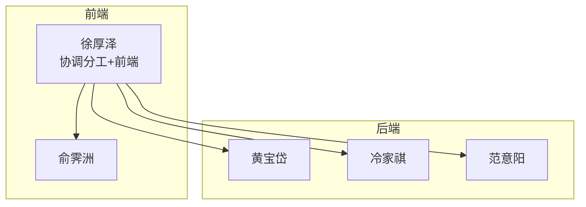
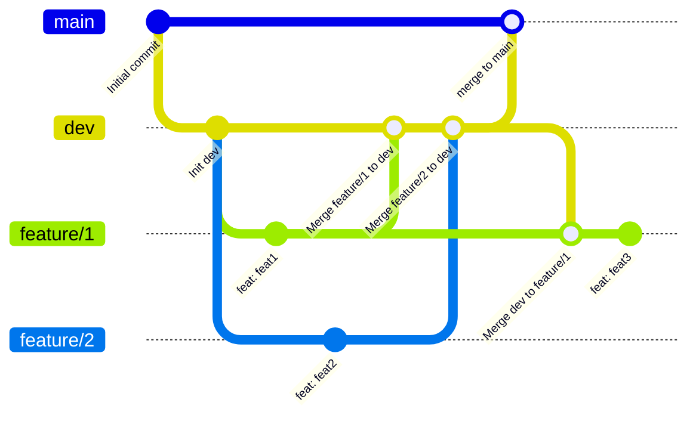
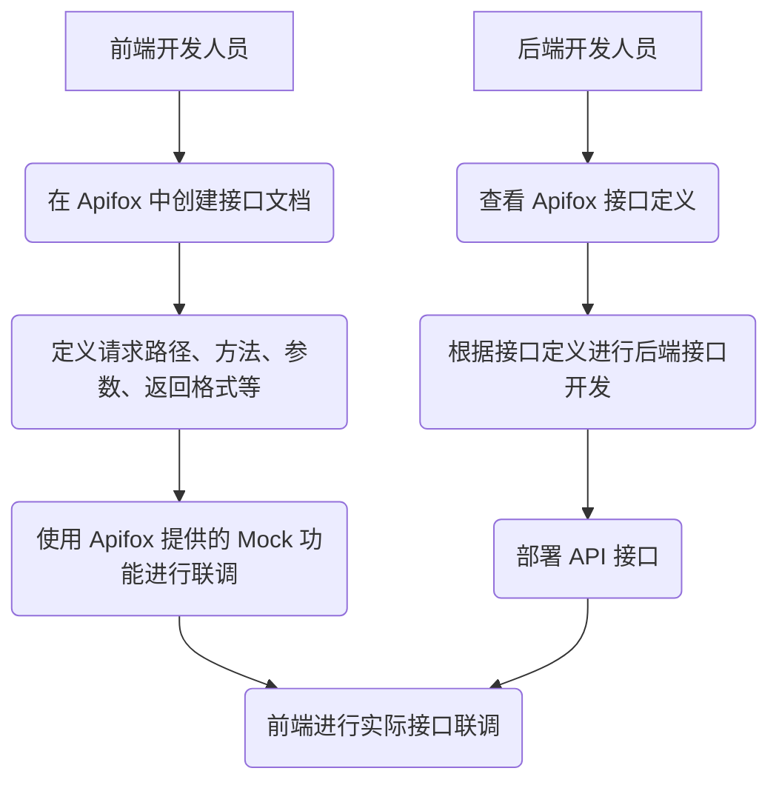
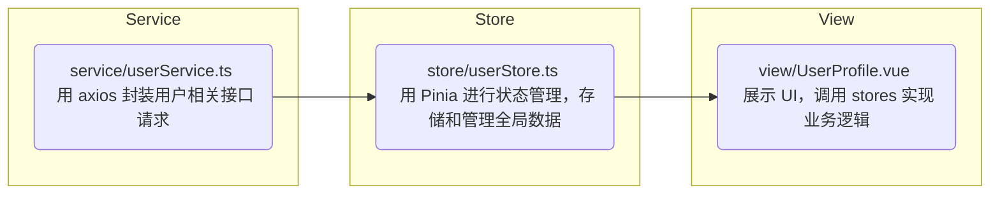

---
# You can also start simply with 'default'
theme: seriph
# random image from a curated Unsplash collection by Anthony
# like them? see https://unsplash.com/collections/94734566/slidev
background: https://www.fudan.edu.cn/_upload/article/images/3f/d6/20e8302b43d6a2db9e008b2093db/59446dc8-b8b9-41fe-850a-70c6e4cdce62_s.jpg
# some information about your slides (markdown enabled)
title: 软件工程2025
info: |
  ## Slidev Starter Template
  Presentation slides for developers.

  Learn more at [Sli.dev](https://sli.dev)
# apply unocss classes to the current slide
class: text-center
# https://sli.dev/features/drawing
drawings:
  persist: false
# slide transition: https://sli.dev/guide/animations.html#slide-transitions
transition: slide-left
# enable MDC Syntax: https://sli.dev/features/mdc
mdc: true
# open graph
# seoMeta:
#  ogImage: https://cover.sli.dev
---

# 软件工程期末汇报

第三组：范意阳 黄宝岱 冷家祺 徐厚泽 俞霁洲

<!-- <div class="abs-br m-6 text-xl">
  <button @click="$slidev.nav.openInEditor()" title="Open in Editor" class="slidev-icon-btn">
    <carbon:edit />
  </button>
  <a href="https://github.com/slidevjs/slidev" target="_blank" class="slidev-icon-btn">
    <carbon:logo-github />
  </a>
</div> -->

<!--
The last comment block of each slide will be treated as slide notes. It will be visible and editable in Presenter Mode along with the slide. [Read more in the docs](https://sli.dev/guide/syntax.html#notes)
-->

---
level: 1
---

# 目录

<Toc minDepth="2" maxDepth="3" />

<!--
You can have `style` tag in markdown to override the style for the current page.
Learn more: https://sli.dev/features/slide-scope-style
-->

<style>
h1 {
  background-color: #2B90B6;
  background-image: linear-gradient(45deg, #4EC5D4 10%, #146b8c 20%);
  background-size: 100%;
  -webkit-background-clip: text;
  -moz-background-clip: text;
  -webkit-text-fill-color: transparent;
  -moz-text-fill-color: transparent;
}
</style>

<!--
Here is another comment.
-->

---
level: 2
---

# 团队协作与管理



---
level: 3
---

# git分支管理



---
level: 3
---

# 接口定义

<div style="text-align: center">



</div>

---
level: 2
---

# 系统设计与架构


### 设计模式

- 单例模式

  - Service层 `UserService`, `StoreService`

  ```java
  public class UserController {
      private final UserService userService;
      // ...
  }

  public class StoreController {
      private final StoreService storeService;
      // ...
  }
  ```

  - 工具类 `JwtUtil`, `SecurityUtils`...

---
level: 2
---

# 编码规范

- 使用了统一的驼峰命名法

```java
public class Account {
    @Id
    @GeneratedValue(strategy = GenerationType.IDENTITY)
    @Getter
    private Long accountId;

    @OneToOne(fetch = FetchType.EAGER)
    @JoinColumn(name = "user_id", referencedColumnName = "user_id")
    @Getter @Setter
    private User accountUser;  // 关联的用户

    @Column(name = "balance", nullable = false)
    @Getter @Setter
    private Long accountBalance = 0l;

    @Column(name = "status", nullable = false)
    @Getter
    private String accountStatus = "active";  // 账户状态，默认为正常状态
}
```

---
level: 2
---

- 良好的Javadoc风格注释

```java
/**
 * 认证拦截器，用于处理基于角色和路径的权限控制。
 * <p>
 * 本拦截器提供两种权限检查方式：
 * <ol>
 *   <li><b>注解驱动</b>：通过 {@link MethodRoles} 或 {@link PreAuthorize} 注解声明方法权限</li>
 *   <li><b>路径驱动</b>：根据请求路径前缀自动匹配所需角色</li>
 * </ol>
 *
 * <p><b>权限检查流程：</b>
 * <ul>
 *   <li>1. 检查是否已认证（未认证返回403）</li>
 *   <li>2. 优先检查方法注解（{@code @MethodRoles}）</li>
 *   <li>3. 若无方法注解，则根据路径前缀检查角色</li>
 *   <li>4. 默认路径允许所有认证用户访问</li>
 * </ul>
 *
 * @see HandlerInterceptor
 * @see MethodRoles
 */
@Component
public class AuthInterceptor implements HandlerInterceptor {
//...
}
```

---
level: 2
---

# Pinia 状态管理



```typescript
// userStore.ts
export const useStoreStore = defineStore('store', () => {
  const stores = ref<Store[]>([])
  const fetchStores = async () => {
    try {
      const response = await storeService.getAll()
      stores.value = response.data
    } catch (err) {...} finally {...}
  }
  return {
    stores,
    fetchStores
  }
})
```

---
level: 2
---

# 问题与反思

- 前端混沌态😵
  - 由于赶进度+缺乏沟通，前端一开始把部分api调用、状态管理写入了视图🤬
  - 在lab3进行了一次彻底的大讨论与重构

- 命名不统一❌
  - 由于缺乏沟通，前端的商铺类定义为 `Store`，而后端定义为 `Shop`

## *有效的沟通是成功的前提！*
